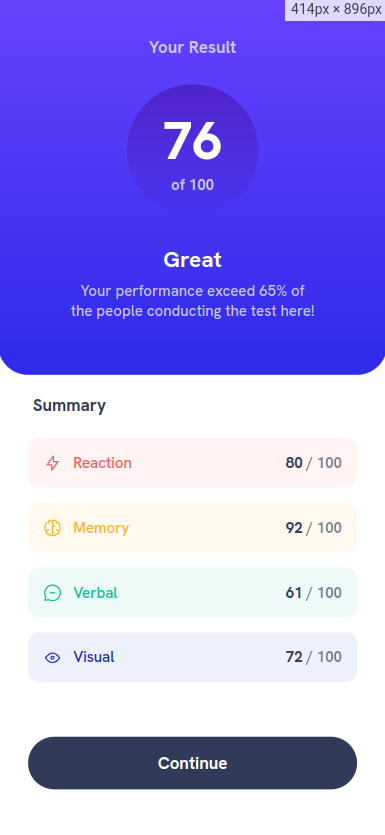

# Frontend Mentor - Results summary component solution

This is a solution to the [Results summary component challenge on Frontend Mentor](https://www.frontendmentor.io/challenges/results-summary-component-CE_K6s0maV). Frontend Mentor challenges help you improve your coding skills by building realistic projects. 

## Table of contents

- [Overview](#overview)
  - [The challenge](#the-challenge)
  - [Screenshot](#screenshot)
  - [Links](#links)
- [My process](#my-process)
  - [Built with](#built-with)
  - [What I learned](#what-i-learned)
  - [Continued development](#continued-development)
- [Author](#author)

## Overview

### The challenge

Users should be able to:

- View the optimal layout for the interface depending on their device's screen size
- See hover and focus states for all interactive elements on the page

### Screenshot

 | 

### Links
-- Live Site URL: <a href="">Live Website</a>

## My process

### Built with

- Semantic HTML5 markup
- Flexbox
- Mobile-first workflow
- [Next.js](https://nextjs.org/) - React framework
- [Stitches.js](https://stitches.dev/) - For styles

### What I learned

#### How to use Stitches.js to generate CSS in the server-side

```jsx
import { Html, Head, Main, NextScript } from 'next/document'
import { getCssText } from '@/styles'
import { globalStyles } from '@/styles/globals'

globalStyles()

export default function Document() {
  return (
    <Html lang="en">
      <Head>
        <style id="stitches" dangerouslySetInnerHTML={{__html: getCssText()}}></style>
      </Head>
      <body>
        <Main />
        <NextScript />
      </body>
    </Html>
  )
}
```

#### How to fetch data from an API on the server-side using Next.js

```js
export async function getServerSideProps() {
  const response = await fetch('http://localhost:3000/api/results')
  const data = await response.json()

  return {
    props: {
      results: data
    }
  }
}
```

### Continued development

This is my first project with Next.js and also with Stitches.js, I really loved those two tecnologies and for sure will implement them on my next projects.

While I'm already getting used to Stitches.js, I still have a long way to go when to comes to using Next.js to it's full potential.

## Author

- Website - [Wellington Damasio](https://wellingtondamasio.com)
- Frontend Mentor - [@wellington-damasio](https://www.frontendmentor.io/profile/wellington-damasio)
